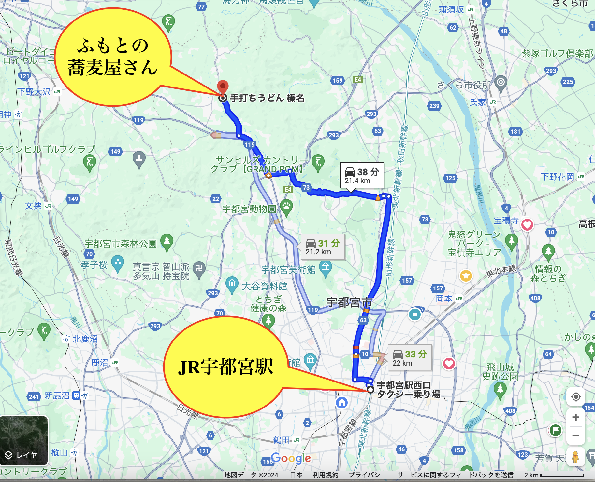

# kodomonomori

<html lang="ja">
 <head>
  <meta charset="utf-8" />
	 

<link href="https://cdnjs.cloudflare.com/ajax/libs/lightbox2/2.7.1/css/lightbox.css" rel="stylesheet">
 
</head>
<body>

  モバイル端末をお使いの場合は、画面を横向きにすると
  より見やすくご覧頂けます。

	

 アクセス用QRコード

<marquee direction="right" scrollamount="20" width="30%">(^_^)/~hada</marquee>

	
<h1><marquee behavior="left">!!! 2024年5月6日(月)宇都宮北端部の山あいのお蕎麦屋さん、裏山が県の施設でした !!!</marquee></h1>

<h3>5月連休は人混みばかりで出かけたくないな〜と思っていたら、宇都宮北端部に意外な穴場。</h3>	
<h3>その名も、「平成記念こどものもり公園」。</h3>
	
                            
<h3>その名も、「平成記念こどものもり公園」。</h3>

<h3>連休中なのに、行き交ったのは２組だけでした。</h3>

<h3>道沿いのお蕎麦やさん「榛名」が目印。</h3>

	
         
	

                                       

<marquee direction="left" scrollamount="5" width="85%">以上、ここまでご覧いただき、ありがとうございました！ (^_^)/~hada</marquee>

  

 

<!-- フッタ -->
 <footer>
 Copyright 2024/05/06 S.Hada
	 </footer>
